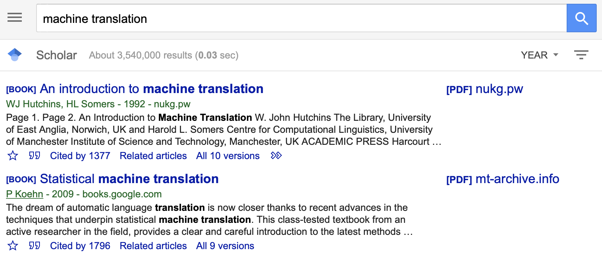

# sumiyoshi\_demo
Google scholar から論文情報を抽出するツールを作成した。

## 1. スクレイピングの仕組み
1. url をリクエスト
   * （大量にリクエストすると BAN されてしまうので注意）
   * （重要そうな論文順に、1ページ10件並んでいる）
1. html を BeautifulSoup で解析。論文情報抽出。

## 2. 複合キーワード検索
通常のキーワード検索だと**古い年代の有名な文献**が出てくる  

→検索の際に分野に関係のある**キーワード**だけではなく、  
**出版（会議）名**・**論文が公開された年**も指定したい  

---  

**複合条件**（キーワード・出版名・出版年）で検索できるように修正した（今後公開予定）
1. キーワード、出版名、出版年を入力
1. url をリクエストし、上位100件を検索
1. 論文の情報（タイトル、著者、出版年、引用数、url、スニペット）を抽出
1. csv に出力

## 3. ある論文を引用している論文、引用数の推移
対象論文発行年〜2021年間の年ごとの対象論文引用数を取得
- 引用論文の発行年を取得することで実現

後にでる、レジェンド論文、可視化論文の被引用推移を可視化するために使用

**被引用推移取得までの流れ**
1. 著者、キーワード、出版名、出版年を入力
1. url をリクエストし、上位10件を表示・対象論文を選択
1. 選んだ論文を引用している論文を上位100件検索
1. 論文の情報・各年の引用数の推移を抽出し、csv に出力

## 4. 分野のレジェンド論文・バズ論文を可視化
**分野の初学者**に向けて、読んでおくべき2種類の論文を提案  
- **レジェンド論文**：年代を問わず重要な論文
- **バズ論文**：最近出版され、注目されている論文

---

それぞれ以下のように定義して、**論文情報・引用推移**をスクレイピングした
- レジェンド論文：単純なキーワード検索で上位に来る論文
- バズ論文：キーワード＋出版年の複合検索で上位に来る論文

---

得られた情報を csv に保存し、**Web アプリ上で可視化**を行った

